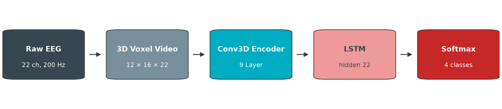
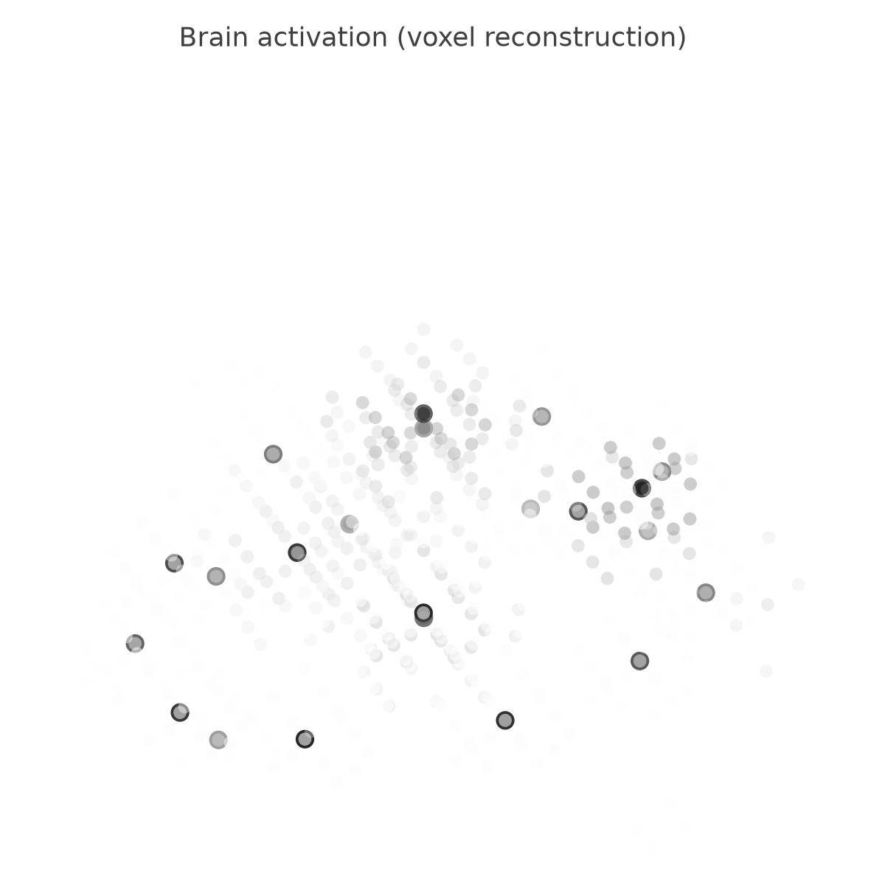
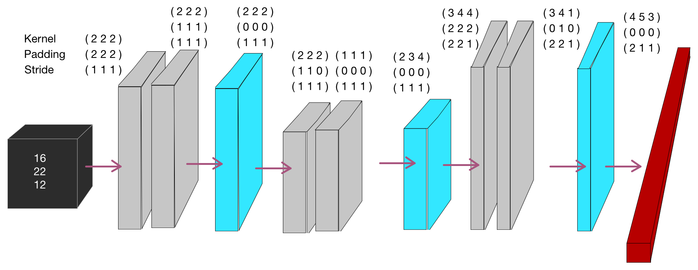

# End-to-End-EEG-Classifier

End-to-end classification of motor-imagery EEG with a 3D-CNN + LSTM pipeline in PyTorch.

[](LICENSE)


## TL;DR

Instead of hand-crafted EEG feature engineering, this project treats brain activity as a
3D voxel video: the 22 electrode channels of the
[Kaya et al. (2018)](https://doi.org/10.1038/sdata.2018.211) CLA dataset are reconstructed
into small 3D brain volumes and classified end to end with a 3D CNN, optionally combined
with an LSTM over time. The result is a negative one: the plain 3D CNN alone reaches
roughly 72 to 76 percent accuracy, while the CNN-LSTM combination stays at 50 to 60
percent and is far slower to train. The main lesson is about cost: the 3D reconstruction
expands the dataset to roughly 400 GB and about one hour of GPU time per epoch, which the
modest accuracy does not justify.

## Pipeline



- The 22 electrode positions are reconstructed on a head ellipsoid with semi-axes
  a = 72.5, b = 100, c = 56 and mapped onto a `12 x 16 x 22` voxel grid.
- Each frame is built by writing the electrode activations into the grid and
  interpolating neighbors with a 1/r falloff.
- The grid is asymmetric, so the network uses asymmetric kernel sizes, padding, and strides.
- Training sequences span 200 frames (1 s at 200 Hz); each sequence carries exactly one
  label, taken from its final frame.
- The CNN is pretrained first, then its fully connected head is replaced by the LSTM on
  the `1 x 1 x 22` feature vector, and the combined network is trained jointly.
- The paper's runs used Adam with a cyclic learning rate |cos(i) x 1e-4|, momentum 0.9,
  weight decay 1e-9, batches of 4 x 200-frame sequences, and 15 epochs.

## Results

| Model | Input | Accuracy | Note |
|---|---|---|---|
| 3D CNN | voxel frames, `12 x 16 x 22` | ~72-76% | best model; up to 76.5% on one subject |
| 3D CNN + LSTM | sequences of 4 x 200 voxel frames | ~50-60% | slowest to train, no gain over the CNN alone |
| LSTM on raw EEG | raw 22-channel time series | ~70-72% | fastest to train; ~2.6 percentage points below the 3D CNN on average |

All numbers come from the accompanying paper ([docs/paper.pdf](docs/paper.pdf)). The
per-subject tables are reproduced in [results/results.md](results/results.md).

## Brain activation



One reconstructed frame: the 22 electrodes are placed on the ellipsoid-derived grid
positions and their activation is spread to surrounding voxels with a 1/r falloff, shown
here as a grayscale 3D scatter. The figure was rendered with
`eeg_classifier.visualize` (synthetic demo activation).

## Architecture



The encoder is a 9-layer 3D CNN with batch normalization, ReLU, and periodic max pooling.
Because the input grid is non-cubic, kernel size, padding, and stride differ per axis;
the stack reduces each `12 x 16 x 22` frame to a `1 x 1 x 22` feature vector.

## Setup and usage

```bash
pip install -r requirements.txt
```

A GPU is recommended for training the CNN models, and the 3D-preprocessed dataset is
large (roughly 400 GB for the full expansion, ~40 MB per raw session file).

### Download the dataset

```bash
python scripts/download_data.py             # all 17 CLA sessions into data/raw/
python scripts/download_data.py --limit 1   # smoke test with a single file
```

The script pulls the public Figshare deposition of the Kaya et al. dataset and verifies
MD5 checksums. Options: `--out` (target directory, default `data/raw`), `--paradigm`
(`CLA` by default; also `5F`, `HALT`, `FREEFORM`, `NOMT`, or `all`), `--limit`,
`--collection`, and `--no-verify`.

### Preprocess into voxel batches

```bash
PYTHONPATH=src python -c "from eeg_classifier.data import prepare_subject; \
  prepare_subject('data/raw/CLA-SubjectA-160108-3St-LRHand.mat', 0)"
```

This cleans the session, computes per-session normalization statistics, and writes
`train_<n>.pickle` / `val_<n>.pickle` voxel batches to `data/VideoBatches/subject0/`.

### Train

```bash
PYTHONPATH=src python -m eeg_classifier.train --help
PYTHONPATH=src python -m eeg_classifier.train \
  --model cnn_lstm --epochs 25 --device cpu --data-dir data/VideoBatches
```

Flags: `--model` (`cnn_lstm` default; `cnn` is an alias, `lstm` has no standalone
training path), `--name` (checkpoint name), `--net` (pickle to continue training from),
`--epochs`, `--batch-size` (accepted for parity; the loop always stacks 4 x 200-frame
sequences), `--device` (`cuda` or `cpu`, defaults to cuda when available), `--lr`,
`--weight-decay`, `--momentum`, `--start`/`--end` (subject index range; subject 7 is
always skipped), `--data-dir`, `--checkpoint-dir` (default `results/checkpoints`).

### Evaluate

```bash
PYTHONPATH=src python -m eeg_classifier.evaluate \
  --checkpoint results/checkpoints/CNN-LSTM-1.pickle --data-dir data/VideoBatches
```

Prints overall and per-subject accuracy plus a confusion matrix. Flags: `--checkpoint`
(required), `--split` (`train` or `val`, default `val`), `--device`, `--start`/`--end`,
`--data-dir`.

### Visualize a voxel frame

```bash
PYTHONPATH=src python -m eeg_classifier.visualize --demo \
  --output assets/brain_activation.png
```

## Dataset

The project uses the CLA subset of the motor-imagery dataset by
[Kaya et al. (2018), Scientific Data](https://doi.org/10.1038/sdata.2018.211), downloaded
from the official [Figshare collection](https://doi.org/10.6084/m9.figshare.c.3917698)
(17 CLA session files as MATLAB `.mat`, ~40 MB each). Each session contains 22 EEG
channels sampled at 200 Hz and a marker channel with the class codes:
0 no task (blank), 1 left hand, 2 right hand, 3 passive. Subject 7 was excluded from all
runs.

## Repository structure

```text
.
├── assets/                             figures used in this README
├── docs/paper.pdf                      project paper (methodology and results)
├── notebooks/01_original_colab.ipynb   original 2021 Colab notebook, kept as-is
├── results/results.md                  per-subject results from the original runs
├── scripts/download_data.py            dataset downloader (Figshare)
└── src/eeg_classifier/
    ├── data.py        session cleaning, 3D voxel reconstruction, batch pickles
    ├── models.py      SimpleLSTM and eeg_shallow_CNN (3D CNN + LSTM head)
    ├── train.py       training CLI
    ├── evaluate.py    evaluation CLI with per-subject accuracy and confusion matrix
    └── visualize.py   3D scatter rendering of voxel frames
```

## Limitations and learnings

- 22 electrodes instead of the 64 used in comparable datasets produce a very sparse 3D
  reconstruction; low spatial resolution is the most plausible ceiling for this approach.
- The 3D expansion grew the dataset to roughly 400 GB. Batches had to be streamed
  dynamically from cloud storage during Colab training, and one epoch took about an hour.
- The original notebook had a real bug: validation batches were written from the training
  loader, so the `val_*` files silently contained training data. The 2026 refactor fixed
  the split.
- The dataset's label quality was never independently verified; at the time of the
  original project it had no citations.
- The standalone CNN and LSTM numbers in the paper predate this package: the current CLI
  trains and evaluates the `cnn_lstm` model only.

## Paper and citation

The full methodology, training details, and result tables are in the accompanying paper:
[docs/paper.pdf](docs/paper.pdf).

```bibtex
@article{kaya2018large,
  title   = {A large electroencephalographic motor imagery dataset for
             electroencephalographic brain computer interfaces},
  author  = {Kaya, Murat and Binli, Mustafa Kemal and Ozbay, Erkan and
             Yanar, Hilmi and Mishchenko, Yuriy},
  journal = {Scientific Data},
  volume  = {5},
  pages   = {180211},
  year    = {2018},
  doi     = {10.1038/sdata.2018.211}
}

@software{mouroum2021eeg,
  title  = {End-to-End-EEG-Classifier},
  author = {Mouroum, Marvin},
  year   = {2021},
  note   = {University project; refactored for release in 2026}
}
```

## Historical note

The code was written in 2021 as a university project and trained on Google Colab. In 2026
it was refactored from the original notebook into a clean package without changing the
model semantics, so the historical results stay comparable. The original notebook is
preserved unchanged in [notebooks/01_original_colab.ipynb](notebooks/01_original_colab.ipynb).
